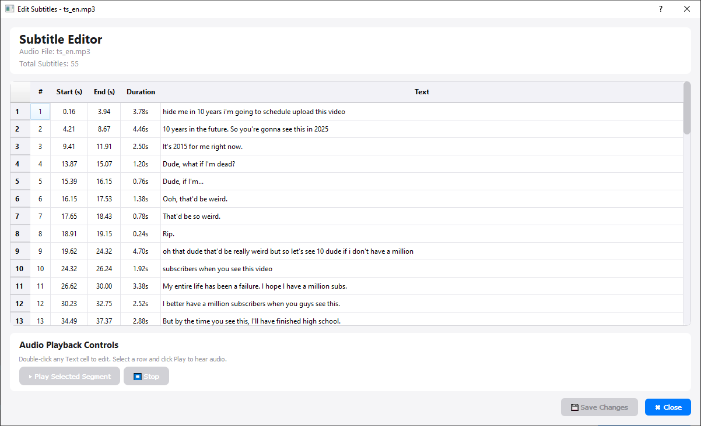

# Advanced Subtitle Generator

A powerful and user-friendly subtitle generation tool powered by OpenAI's Whisper AI. Generate accurate subtitles for your videos and audio files with both GUI and CLI interfaces, featuring real-time editing and audio playback capabilities.




## ✨ Features

### 🎯 Core Capabilities
- **AI-Powered Transcription**: Leverages OpenAI Whisper with faster-whisper for state-of-the-art speech recognition
- **Multiple Output Formats**: Export subtitles in SRT, VTT, JSON, or all formats at once
- **Batch Processing**: Process multiple media files simultaneously with progress tracking
- **Word-Level Timestamps**: Optional word-by-word timing for precise synchronization
- **Multi-Language Support**: Automatic language detection or manual language selection (50+ languages)

### 🎨 User Interface
- **Modern GUI**: Intuitive PyQt5-based interface with drag-and-drop support
- **Interactive Subtitle Editor**: Built-in editor with audio playback and real-time synchronization
- **CLI Tool**: Powerful command-line interface for automation and scripting
- **Real-Time Progress**: Live progress tracking with detailed logs and status updates
- **File Management**: Easy file list management with preview and removal options

### ✏️ Subtitle Editor
- **In-App Editing**: Edit generated subtitles directly within the application
- **Audio Playback**: Play selected subtitle segments to verify timing and accuracy
- **Visual Timeline**: See which subtitle is currently playing with real-time highlighting
- **Quick Save**: Export edited subtitles instantly in your chosen format
- **Safe Editing**: Non-destructive editing with save confirmation

### 🔧 Advanced Processing
- **Noise Reduction**: Optional audio noise reduction using noisereduce for clearer transcription
- **Smart Chunking**: Intelligent audio segmentation based on silence detection
- **GPU Acceleration**: CUDA support for significantly faster processing
- **Configurable Parameters**: Fine-tune silence detection, chunk duration, and processing settings
- **Chunk Merging**: Automatically merge small chunks for better subtitle flow

### 🎛️ Model Options
Supports all Whisper model sizes:
- `tiny` - Fastest, lower accuracy (~1GB VRAM)
- `base` - Balanced speed and accuracy (~1GB VRAM)
- `small` - Good accuracy, reasonable speed (~2GB VRAM)
- `medium` - High accuracy (~5GB VRAM)
- `large` - Highest accuracy (~10GB VRAM)
- `large-v2` - Enhanced large model (~10GB VRAM)
- `large-v3` - Latest large model with best accuracy (default, ~10GB VRAM)
- `turbo` - Optimized for speed with good accuracy (~6GB VRAM)

## 📋 Requirements

### System Requirements
- Python 3.8 or higher
- Windows, macOS, or Linux
- Optional: NVIDIA GPU with CUDA support for hardware acceleration
- Minimum 4GB RAM (8GB+ recommended for larger models)

### Dependencies
All dependencies are listed in `requirements.txt`:
- `numpy>=2.3.3` - Numerical computing and array operations
- `faster-whisper>=1.2.0` - Optimized Whisper implementation with CTranslate2 backend
- `librosa>=0.11.0` - Audio loading and analysis
- `soundfile>=0.13.1` - Audio file I/O operations
- `tqdm>=4.67.1` - Progress bars for CLI
- `noisereduce>=3.0.3` - Audio noise reduction (optional feature)
- `resampy>=0.4.3` - High-quality audio resampling
- `PyQt5>=5.15.11` - GUI framework and multimedia support

## 🚀 Installation

### 1. Clone the Repository
```bash
git clone https://github.com/newnonsick/subtitle-generator.git
cd subtitle-generator
```

### 2. Create Virtual Environment (Recommended)
```bash
python -m venv venv

# Windows
venv\Scripts\activate

# macOS/Linux
source venv/bin/activate
```

### 3. Install Dependencies
```bash
pip install -r requirements.txt
```

### 4. GPU Support (Optional)
For CUDA acceleration on NVIDIA GPUs:
- Ensure NVIDIA drivers are up to date
- Install CUDA toolkit 11.2 or higher
- CTranslate2 with CUDA support (usually installed automatically with faster-whisper)

**Note**: On Windows, you may need to set CUDA paths. The project includes `set_cuda_paths.py` to help with this.

## 💻 Usage

### GUI Mode (Recommended for Most Users)

Launch the graphical interface:
```bash
python gen_sub_gui.py
```

**GUI Workflow:**
1. **Add Files**: Click "Add Files" button or drag and drop media files into the window
2. **Configure Settings**: 
   - Select Whisper model size (default: large-v3)
   - Choose output format (SRT, VTT, JSON, or all)
   - Set language (or leave as "Auto Detect")
   - Select device (Auto/CPU/CUDA)
3. **Advanced Settings** (Optional):
   - Enable noise reduction for noisy audio
   - Adjust silence detection thresholds
   - Configure chunk processing parameters
   - Enable word-level timestamps
4. **Generate**: Click "Generate Subtitles" and monitor real-time progress
5. **Edit** (Optional): After generation, click "Edit Subtitles" to:
   - Review and modify subtitle text
   - Play audio segments to verify timing
   - Make adjustments and save changes
6. **View Logs**: Check the console panel for detailed processing information and statistics

### CLI Mode (For Automation)

Basic usage:
```bash
python gen_sub_cli.py "video.mp4"
```

#### Common Examples

**Specify language and model:**
```bash
python gen_sub_cli.py "video.mp4" --language en --model base
```

**Enable noise reduction for noisy audio:**
```bash
python gen_sub_cli.py "noisy_audio.mp3" --noise-reduction
```

**GPU acceleration with highest quality:**
```bash
python gen_sub_cli.py "video.mp4" --model large-v3 --device cuda --compute-type float16
```

**Word-level timestamps in JSON format:**
```bash
python gen_sub_cli.py "video.mp4" --word-timestamps --format json
```

**Batch processing multiple files:**
```bash
python gen_sub_cli.py video1.mp4 video2.mp4 video3.mp4 --output-dir ./subtitles
```

**Export all formats at once:**
```bash
python gen_sub_cli.py "video.mp4" --format all
```

**Custom silence detection for better segmentation:**
```bash
python gen_sub_cli.py "video.mp4" --silence-thresh -35 --min-silence 500
```

**Process with multiple workers (faster on multi-core CPUs):**
```bash
python gen_sub_cli.py "video.mp4" --workers 4
```

### CLI Arguments

#### Input/Output Options
- `media_files` - Path(s) to media file(s) (required)
- `-o, --output` - Output file path or directory
- `-f, --format` - Output format: srt, vtt, json, all (default: srt)

#### Model Configuration
- `-m, --model` - Whisper model size (default: large-v3)
- `-l, --language` - Language code (e.g., en, es, fr) or auto-detect
- `-d, --device` - Compute device: auto, cpu, cuda (default: auto)
- `-c, --compute-type` - Compute type: float16, float32, int8 (default: float16)

#### Audio Processing
- `--noise-reduction` - Enable audio noise reduction
- `--silence-thresh` - Silence threshold in dBFS (default: -40)
- `--min-silence` - Minimum silence length in ms (default: 700)
- `--max-chunk` - Maximum chunk duration in seconds (default: 30.0)

#### Advanced Options
- `--word-timestamps` - Include word-level timestamps
- `--no-merge-chunks` - Disable chunk merging
- `-w, --workers` - Number of worker threads (default: 4)
- `-v, --verbose` - Enable verbose logging
- `-q, --quiet` - Suppress most output

## 📁 Project Structure

```
subtitle-generator/
├── gen_sub_gui.py             # GUI application entry point
├── gen_sub_cli.py             # CLI application entry point
├── requirements.txt           # Python dependencies
├── set_cuda_paths.py          # CUDA environment setup helper (Windows)
├── setup_cuda_env.sh          # CUDA environment setup helper (Linux/macOS)
├── LICENSE                    # MIT License
├── README.md                  # This file
├── readme-assets/             # Documentation assets
│   ├── demo_gui.png              # Main GUI screenshot
│   └── edit_procressed_subtitles.png  # Editor screenshot
└── src/                       # Source code package
    ├── __init__.py               # Package initialization
    ├── audio_processor.py        # Audio loading, chunking, and noise reduction
    ├── cli.py                    # Command-line interface implementation
    ├── config.py                 # Configuration constants and settings
    ├── exporters.py              # Subtitle format exporters (SRT, VTT, JSON)
    ├── gui.py                    # Main GUI window implementation
    ├── gui_widgets.py            # Custom GUI widgets and components
    ├── models.py                 # Data models (Subtitle, ProcessingStats)
    ├── subtitle_editor.py        # Interactive subtitle editor dialog
    ├── subtitle_generator.py     # Core subtitle generation logic
    └── utils.py                  # Utility functions and helpers
```

## 🎯 Supported Formats

### Input Formats
**Audio:**
- MP3 (.mp3)
- WAV (.wav)
- M4A (.m4a)
- FLAC (.flac)
- OGG (.ogg)

**Video:**
- MP4 (.mp4)
- AVI (.avi)
- MKV (.mkv)
- MOV (.mov)

*Note: Audio is automatically extracted from video files during processing.*
- OGG (.ogg)

**Video:**
- MP4 (.mp4)
- AVI (.avi)
- MKV (.mkv)
- MOV (.mov)

### Output Formats
- **SRT** - SubRip format (most compatible, widely supported)
- **VTT** - WebVTT format (web-friendly, HTML5 video)
- **JSON** - Structured data with metadata and optional word-level timestamps
- **ALL** - Export all formats simultaneously with a single command

## ⚙️ Configuration

### Default Settings
The application comes with sensible defaults optimized for most use cases:
- **Model**: `large-v3` (best accuracy available)
- **Device**: Auto-detect (uses CUDA if available, falls back to CPU)
- **Compute Type**: `float16` (optimal balance of speed and accuracy)
- **Language**: Auto-detect (supports 50+ languages)
- **Silence Threshold**: `-40 dBFS`
- **Minimum Silence**: `700ms`
- **Target Chunk Duration**: `5.0s`
- **Maximum Chunk Duration**: `30.0s`
- **Workers**: 1 (can be increased for faster processing)

### Customization Options
All settings can be adjusted through:
- **GUI**: Advanced Settings expandable panel with intuitive controls
- **CLI**: Command-line arguments (see `--help` for full list)
- **Code**: Modify `src/config.py` for permanent defaults

### Performance Tips
- Use `turbo` or `base` model for faster processing
- Enable CUDA for 3-10x speed improvement on compatible GPUs
- Adjust chunk duration to balance memory usage and processing speed
- Increase workers for CPU-bound workloads on multi-core systems

## 🔍 How It Works

The subtitle generation process follows these steps:

1. **Audio Extraction & Loading**: 
   - Extracts audio from video files or loads audio files directly
   - Resamples to 16kHz mono (Whisper's required format)
   - Uses librosa for high-quality audio processing

2. **Preprocessing** (Optional):
   - Applies noise reduction using spectral gating
   - Improves transcription accuracy for noisy recordings
   - Can be toggled on/off based on audio quality

3. **Intelligent Chunking**:
   - Analyzes audio to detect silence points
   - Splits audio at natural pauses for better context
   - Configurable thresholds for different audio types
   - Prevents cutting words mid-sentence

4. **AI Transcription**:
   - Processes each chunk through Whisper model
   - Generates text with timestamps
   - Optional word-level timing for precision editing
   - Supports automatic language detection

5. **Post-processing**:
   - Merges overlapping or very close subtitles
   - Optimizes subtitle timing and duration
   - Ensures proper sequencing and indexing

6. **Export & Editing**:
   - Saves subtitles in selected format(s)
   - Optional interactive editing with audio playback
   - Statistics and performance metrics logging

## 🐛 Troubleshooting

### Common Issues

**Import Error: faster-whisper or other dependencies**
```bash
pip install --upgrade -r requirements.txt
```

**CUDA Not Detected / GPU Not Used**
- Ensure NVIDIA drivers are up to date (latest version recommended)
- Install CUDA toolkit 11.2 or higher from NVIDIA website
- Verify GPU is CUDA-compatible: `nvidia-smi` in terminal
- On Windows, run `python set_cuda_paths.py` to configure paths
- Reinstall faster-whisper: `pip install --force-reinstall faster-whisper`

**Out of Memory (GPU)**
- Use a smaller model: `--model base` or `--model small`
- Switch to CPU processing: `--device cpu`
- Reduce chunk size: `--max-chunk 15`
- Close other GPU-intensive applications

**Out of Memory (RAM)**
- Use a smaller model (tiny, base, or small)
- Process files one at a time instead of batch
- Reduce number of workers: `--workers 1`

**Poor Transcription Quality**
- Use a larger, more accurate model: `--model large-v3`
- Enable noise reduction: `--noise-reduction`
- Specify the correct language: `--language en` (or your language code)
- Ensure audio quality is good (clear speech, minimal background noise)
- Adjust silence detection parameters for better chunking

**Slow Processing Speed**
- Enable GPU acceleration: `--device cuda` (10-20x faster)
- Use a smaller/faster model: `--model turbo` or `--model base`
- Increase worker count (CPU only): `--workers 4`
- Reduce audio quality if extremely long files

**Subtitles Not Aligned / Timing Issues**
- Adjust silence detection: `--silence-thresh -35 --min-silence 500`
- Enable word-level timestamps for precise editing: `--word-timestamps`
- Use the built-in editor to manually adjust timing
- Check that the audio/video file is not corrupted

**GUI Not Opening / PyQt5 Errors**
```bash
pip install --upgrade PyQt5
# On Linux, you may need: sudo apt-get install python3-pyqt5
```

**No Audio Output in Subtitle Editor**
- Ensure audio file exists and is accessible
- Check that PyQt5 multimedia components are installed
- Try exporting subtitles first, then editing

## 🤝 Contributing

Contributions are welcome! Whether it's bug fixes, new features, documentation improvements, or translations.

### How to Contribute
1. **Fork** the repository
2. **Create** a feature branch (`git checkout -b feature/amazing-feature`)
3. **Make** your changes with clear, descriptive commits
4. **Test** thoroughly (GUI and CLI modes)
5. **Submit** a pull request with a comprehensive description

## 📄 License

This project is licensed under the MIT License - see the [LICENSE](LICENSE) file for details.

## 🙏 Acknowledgments

- **OpenAI Whisper** - The groundbreaking speech recognition model that powers this tool
- **faster-whisper** - Optimized Whisper implementation by Guillaume Klein using CTranslate2
- **PyQt5** - Excellent cross-platform GUI framework with multimedia support
- **librosa** - Comprehensive audio analysis and processing library
- **noisereduce** - Noise reduction implementation for audio preprocessing

## � Contact & Support

For issues, questions, or suggestions:
- **Issues**: [Open an issue on GitHub](https://github.com/newnonsick/subtitle-generator/issues)
- **Discussions**: Use GitHub Discussions for questions and ideas
- **Documentation**: Check this README and code comments
- **Troubleshooting**: Review the troubleshooting section above

---

**Made with ❤️ using OpenAI Whisper AI**
