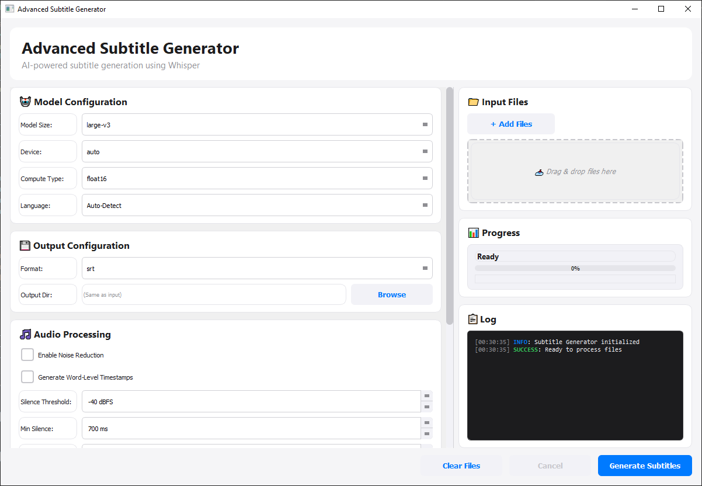

# Advanced Subtitle Generator

A powerful and user-friendly subtitle generation tool powered by OpenAI's Whisper AI. Generate accurate subtitles for your videos and audio files with both GUI and CLI interfaces.



## ✨ Features

### 🎯 Core Capabilities
- **AI-Powered Transcription**: Leverages OpenAI Whisper for state-of-the-art speech recognition
- **Multiple Output Formats**: Export subtitles in SRT, VTT, JSON, or all formats at once
- **Batch Processing**: Process multiple media files simultaneously
- **Word-Level Timestamps**: Optional word-by-word timing for precise synchronization
- **Multi-Language Support**: Automatic language detection or manual language selection

### 🎨 User Interface
- **Modern GUI**: Intuitive PyQt5-based interface with drag-and-drop support
- **CLI Tool**: Powerful command-line interface for automation and scripting
- **Real-Time Progress**: Live progress tracking with detailed logs
- **File Management**: Easy file list management with preview and removal options

### 🔧 Advanced Processing
- **Noise Reduction**: Optional audio noise reduction for clearer transcription
- **Smart Chunking**: Intelligent audio segmentation based on silence detection
- **GPU Acceleration**: CUDA support for faster processing
- **Configurable Parameters**: Fine-tune silence detection, chunk duration, and more

### 🎛️ Model Options
Supports all Whisper model sizes:
- `tiny` - Fastest, lower accuracy
- `base` - Balanced speed and accuracy
- `small` - Good accuracy, reasonable speed
- `medium` - High accuracy
- `large` - Highest accuracy
- `large-v2` - Enhanced large model
- `large-v3` - Latest large model (default)
- `turbo` - Optimized for speed

## 📋 Requirements

### System Requirements
- Python 3.8 or higher
- Windows, macOS, or Linux
- Optional: NVIDIA GPU with CUDA support for acceleration

### Dependencies
All dependencies are listed in `requirements.txt`:
- `numpy>=2.3.3` - Numerical computing
- `faster-whisper>=1.2.0` - Optimized Whisper implementation
- `librosa>=0.11.0` - Audio processing
- `soundfile>=0.13.1` - Audio file I/O
- `tqdm>=4.67.1` - Progress bars
- `noisereduce>=3.0.3` - Noise reduction (optional)
- `resampy>=0.4.3` - Audio resampling
- `PyQt5>=5.15.11` - GUI framework

## 🚀 Installation

### 1. Clone the Repository
```bash
git clone https://github.com/newnonsick/subtitle-generator.git
cd subtitle-generator
```

### 2. Create Virtual Environment (Recommended)
```bash
python -m venv venv

# Windows
venv\Scripts\activate

# macOS/Linux
source venv/bin/activate
```

### 3. Install Dependencies
```bash
pip install -r requirements.txt
```

### 4. GPU Support (Optional)
For CUDA acceleration, ensure you have:
- NVIDIA GPU with CUDA 11.2 or higher
- CTranslate2 with CUDA support

## 💻 Usage

### GUI Mode (Recommended for Beginners)

Launch the graphical interface:
```bash
python gen_sub_gui.py
```

**GUI Features:**
1. **Add Files**: Click "Add Files" or drag and drop media files
2. **Configure**: Select model, language, and processing options
3. **Advanced Settings**: Fine-tune audio processing parameters
4. **Generate**: Click "Generate Subtitles" and monitor progress
5. **View Logs**: Check the console for detailed processing information

### CLI Mode (For Automation)

Basic usage:
```bash
python gen_sub_cli.py "video.mp4"
```

#### Common Examples

**Specify language and model:**
```bash
python gen_sub_cli.py "video.mp4" --language en --model base
```

**Enable noise reduction:**
```bash
python gen_sub_cli.py "noisy_audio.mp3" --noise-reduction
```

**GPU acceleration with high quality:**
```bash
python gen_sub_cli.py "video.mp4" --model large-v3 --device cuda --compute-type float16
```

**Word-level timestamps in JSON format:**
```bash
python gen_sub_cli.py "video.mp4" --word-timestamps --format json
```

**Batch processing:**
```bash
python gen_sub_cli.py *.mp4 --output-dir ./subtitles
```

**Export all formats:**
```bash
python gen_sub_cli.py "video.mp4" --format all
```

### CLI Arguments

#### Input/Output Options
- `media_files` - Path(s) to media file(s) (required)
- `-o, --output` - Output file path or directory
- `-f, --format` - Output format: srt, vtt, json, all (default: srt)

#### Model Configuration
- `-m, --model` - Whisper model size (default: large-v3)
- `-l, --language` - Language code (e.g., en, es, fr) or auto-detect
- `-d, --device` - Compute device: auto, cpu, cuda (default: auto)
- `-c, --compute-type` - Compute type: float16, float32, int8 (default: float16)

#### Audio Processing
- `--noise-reduction` - Enable audio noise reduction
- `--silence-thresh` - Silence threshold in dBFS (default: -40)
- `--min-silence` - Minimum silence length in ms (default: 700)
- `--max-chunk` - Maximum chunk duration in seconds (default: 30.0)

#### Advanced Options
- `--word-timestamps` - Include word-level timestamps
- `--no-merge-chunks` - Disable chunk merging
- `-w, --workers` - Number of worker threads (default: 4)
- `-v, --verbose` - Enable verbose logging
- `-q, --quiet` - Suppress most output

## 📁 Project Structure

```
subtitle-generator/
├── gen_sub_gui.py          # GUI entry point
├── gen_sub_cli.py          # CLI entry point
├── requirements.txt        # Python dependencies
├── LICENSE                 # MIT License
├── README.md              # This file
├── readme-assets/         # Documentation assets
│   └── demo_gui.png
├── src/                   # Source code package
│   ├── __init__.py
│   ├── audio_processor.py    # Audio processing and chunking
│   ├── cli.py               # Command-line interface
│   ├── config.py            # Configuration and constants
│   ├── exporters.py         # Subtitle format exporters
│   ├── gui.py              # GUI implementation
│   ├── gui_widgets.py       # Custom GUI widgets
│   ├── models.py            # Data models
│   ├── subtitle_generator.py # Core subtitle generation
│   └── utils.py             # Utility functions
└── setup_cuda_env.sh       # CUDA setup helper (Linux/macOS)
```

## 🎯 Supported Formats

### Input Formats
**Audio:**
- MP3 (.mp3)
- WAV (.wav)
- M4A (.m4a)
- FLAC (.flac)
- OGG (.ogg)

**Video:**
- MP4 (.mp4)
- AVI (.avi)
- MKV (.mkv)
- MOV (.mov)

### Output Formats
- **SRT** - SubRip format (most compatible)
- **VTT** - WebVTT format (web-friendly)
- **JSON** - Structured data with metadata
- **ALL** - Export all formats simultaneously

## ⚙️ Configuration

### Default Settings
The application comes with sensible defaults:
- Model: `large-v3` (best accuracy)
- Device: Auto-detect (CUDA if available, otherwise CPU)
- Compute Type: `float16` (good balance)
- Silence Threshold: `-40 dBFS`
- Minimum Silence: `700ms`
- Chunk Duration: `5.0s` (target), `30.0s` (maximum)

### Customization
All settings can be adjusted via:
- GUI: Advanced Settings panel
- CLI: Command-line arguments
- Code: Modify `src/config.py`

## 🔍 How It Works

1. **Audio Loading**: Extracts audio from video or loads audio files using librosa
2. **Preprocessing**: Optional noise reduction for better quality
3. **Chunking**: Intelligently splits audio at silence points
4. **Transcription**: Processes each chunk through Whisper AI
5. **Post-processing**: Merges and optimizes subtitle timing
6. **Export**: Saves subtitles in selected format(s)

## 🐛 Troubleshooting

### Common Issues

**Import Error: faster-whisper**
```bash
pip install --upgrade faster-whisper
```

**CUDA Not Detected**
- Ensure NVIDIA drivers are up to date
- Install CUDA toolkit 11.2+
- Reinstall CTranslate2 with CUDA support

**Out of Memory (GPU)**
- Use a smaller model (e.g., `base` or `small`)
- Switch to CPU: `--device cpu`
- Reduce chunk size: `--max-chunk 15`

**Poor Transcription Quality**
- Use a larger model: `--model large-v3`
- Enable noise reduction: `--noise-reduction`
- Specify correct language: `--language en`

**Slow Processing**
- Enable GPU acceleration: `--device cuda`
- Use smaller model: `--model base`
- Reduce worker count on low-memory systems

## 🤝 Contributing

Contributions are welcome! Please feel free to submit issues, fork the repository, and create pull requests.

### Development Setup
1. Fork the repository
2. Create a feature branch
3. Make your changes
4. Test thoroughly
5. Submit a pull request

## 📄 License

This project is licensed under the MIT License - see the [LICENSE](LICENSE) file for details.

## 🙏 Acknowledgments

- **OpenAI Whisper** - The amazing speech recognition model
- **faster-whisper** - Optimized Whisper implementation by Guillaume Klein
- **PyQt5** - Excellent GUI framework
- **librosa** - Comprehensive audio processing library

## 📧 Contact & Support

For issues, questions, or suggestions:
- Open an issue on GitHub
- Check existing documentation
- Review the troubleshooting section

---

**Made with ❤️ using OpenAI Whisper AI**
